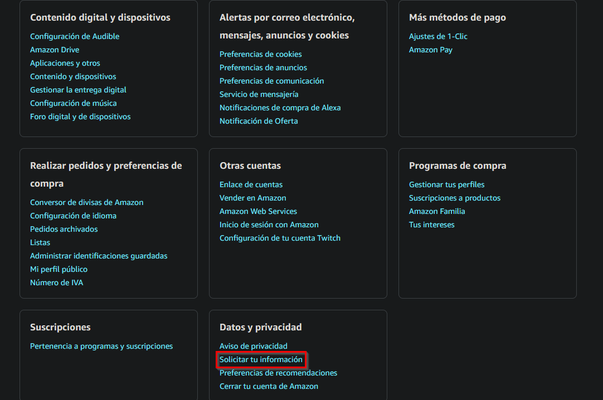

# Amazon-Analysis 📈

Welcome to Amazon-Analysis, a Python project dedicated to analyzing Amazon data.

## Overview 🚀

Amazon-Analysis is a Python project that provides insights and visualizations for Amazon data. It includes the following functionalities:

- **Main Table:** Displays a table with product information, including product name, order date, order ID, and unit price (in €).

- **Providers Table:** Provides a breakdown of the number of products per provider.

- **Payments Table:** Offers information on the number of products per payment method.

- **Resume Table:** Summarizes key statistics, such as total spending, the most expensive product, the cheapest product, and more.

## Features 📊

- Load Amazon data from a CSV file.

- Calculate the highest spending month.

- Display product information, provider statistics, and payment statistics.

- Provide a summary of key statistics.

## Usage 🛠️

1. Download your Amazon data and place the archive called **'Retail.OrderHistory.2.csv'** in the main folder, or enter the path. You can do that by accessing your Account and then:



2. Clone this repository and install packages:
   ```bash
   git clone https://github.com/kumi7567/Python-Projects
   cd Amazon-Analysis
   pip3 install -r requirements.txt
   ```
3. Execute `python amazon_data_analysis.py`
